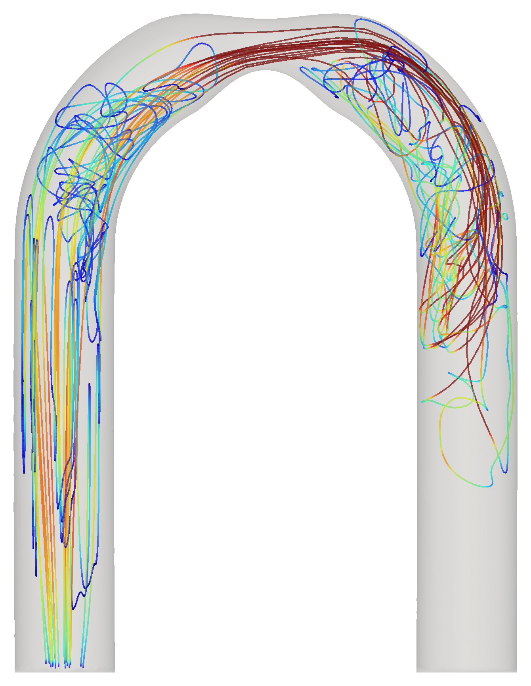

# MRSimTracks

Generate CFD-derived particle trajectories for MR flow simulation.

MRSimTracks performs Lagrangian particle tracking in time-resolved (pulsatile)
CFD meshes. It operates on mesh velocity fields, not MR image data. It seeds
particles in a tetrahedral flow domain, advects them through a time-periodic
velocity field (RK4), and recycles out-of-bounds particles back to the inflow
boundaries with optional **backflow-aware** reseeding.

<p align="center">
  
</p>

<p align="center">
  
  
</p>

The images above are rendered from the full U-bend example tracked with
flux-weighted boundary reseeding over three repeated pulsatile cycles. The
particle animation and selected trajectories use inlet-seeded particles with jet
speed coloring; the density animation uses full-volume seeding with a greyscale
center-slice view.

Regenerate these assets with:

```bash
uv run python scripts/render_readme_assets.py
```

## Install

MRSimTracks is currently published on PyPI as a pre-release:

```bash
uv add "mrsimtracks==0.1.0rc1"
```

or with pip:

```bash
python -m pip install "mrsimtracks==0.1.0rc1"
```

To install the latest source from GitHub instead:

```bash
uv add "mrsimtracks @ git+https://github.com/mcgrathcm/MRSimTracks.git"
```

For development from a clone:

```bash
uv sync          # installs the package (editable) and dependencies
```

The distribution name and Python import package are both `mrsimtracks`.

## Quick start

```python
import numpy as np

import mrsimtracks as mt
from mrsimtracks.seeding import seed_mesh

# 1. Load a time-resolved flow field (.vtu single-file series or .pvd collection)
flow = mt.load_flow("case.pvd", active_key="Velocity")

# 2. (optional) Backflow-aware inflow reseeder from labeled cap surfaces
reseeder = mt.BoundaryReseeder(["Inlet.vtp", "Outlet.vtp"], flow, dt=0.002)

# 3. Seed and track
seeds = seed_mesh(flow.active_mesh, 200_000, rng=np.random.default_rng(0))
result = mt.track(flow, seeds=seeds, dt=0.002, reseeder=reseeder)

# 4. Use / save
result.positions      # (n_steps, n_particles, 3)
result.reset          # (n_steps, n_particles) reseed flags
result.times          # (n_steps,)
result.save("tracks.h5")
```

For large single-process runs, write each timestep directly to HDF5 instead of
keeping all positions in RAM:

```python
result, metrics = mt.track(
    flow,
    seeds=seeds,
    dt=0.002,
    reseeder=reseeder,
    output_path="tracks.h5",
    return_metrics=True,
)

result.is_file_backed  # True until result.positions or result.reset is loaded
metrics["particle_steps_per_s"]
```

Run `example.py` for a complete version using the reduced fixture committed in
`tests/data/`. The full-cycle example flow file is tracked with Git LFS; see
`example/README.md`.

## Large runs (multiple processes)

Each worker reloads the field, so memory scales with `n_workers`:

```python
result = mt.track_parallel(
    "case.pvd", seeds=seeds, dt=0.002,
    caps=["Inlet.vtp", "Outlet.vtp"], active_key="Velocity",
    n_workers=3, subsamp=1,
)
```

## Key functions

| Function | Purpose |
|---|---|
| `load_flow(path, active_key=...)` | Load `.vtu` (one geometry, many time fields) or `.pvd` (series); auto-selects the memory-efficient reader. `subsamp=N` keeps every Nth frame. |
| `track(flow, seeds=..., dt=..., reseeder=...)` | Single-process tracking → `TrackingResult`. Use `output_path=...` for streamed HDF5 output and `return_metrics=True` for timing metrics. |
| `track_parallel(path, ..., caps=..., n_workers=...)` | Multi-process tracking → `TrackingResult`. |
| `BoundaryReseeder(caps, flow, dt=...)` | Flux-weighted, time-resolved inflow reseeder. `caps` = cap surface path(s) or a surface with a `region_id` cell array. |

## Reseeding notes

- The reseeder weights every cap face by `max(-v·n, 0)·area` at the nearest flow
  frame, so particles re-enter only through currently-inflow faces — handling
  backflow and partial inflow/outflow on a single cap.
- `BoundaryReseeder(..., dt=dt)` spreads new particles over a thin inflow
  *volume* (depth `~v_n·dt`) so successive reseeds overlap, keeping spatial
  density smooth (important for MR-style uniform-density use). Omit `dt` for
  plane seeding.
- `flux_waveform()` returns per-cap net flux over the cycle — a conservation /
  validation diagnostic (`Σ caps ≈ 0` for a well-resolved incompressible field).
