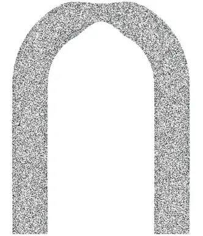
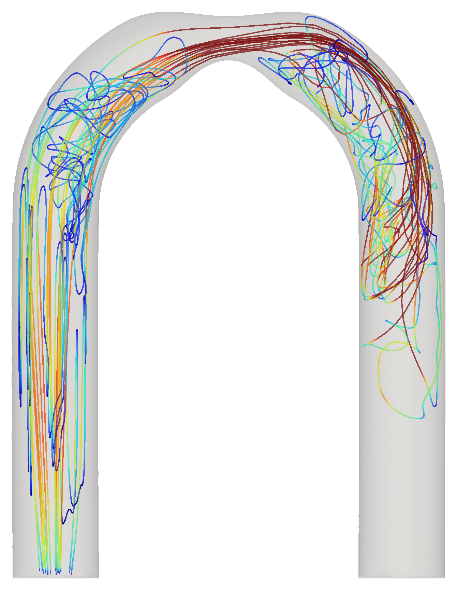
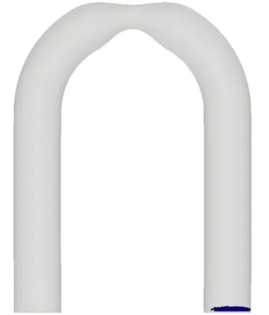

# MRSimTracks

Generate CFD-derived particle trajectories and ground-truth velocity images for
MR flow simulation.

MRSimTracks performs Lagrangian particle tracking in time-resolved (pulsatile)
CFD meshes and samples their velocity fields onto Cartesian reference images in
the mesh coordinate system. It seeds particles in a tetrahedral flow domain,
advects them through a time-periodic velocity field (RK4), and recycles
out-of-bounds particles back to the inflow boundaries with optional
**backflow-aware** reseeding.

<p align="center">
  
  
  
</p>

## Install

MRSimTracks is published on PyPI:

```bash
uv add "mrsimtracks==0.2.0"
```

or with pip:

```bash
python -m pip install "mrsimtracks==0.2.0"
```

To install the latest source from GitHub instead:

```bash
uv add "mrsimtracks @ git+https://github.com/mcgrathcm/MRSimTracks.git"
```

For development from a clone:

```bash
uv sync          # installs the package (editable) and dependencies
```

The distribution name and Python import package are both `mrsimtracks`.

## Quick start

```python
import numpy as np

import mrsimtracks as mt
from mrsimtracks.seeding import seed_mesh

# 1. Load a time-resolved flow field (.vtu, .pvd, directory, or VTU list)
flow = mt.load_flow("case.pvd", active_key="Velocity")

# 2. (optional) Backflow-aware inflow reseeder from labeled cap surfaces
reseeder = mt.BoundaryReseeder(["Inlet.vtp", "Outlet.vtp"], flow, dt=0.002)

# 3. (optional) Near-wall no-penetration projection
wall_slip = mt.WallSlip(flow, caps=["Inlet.vtp", "Outlet.vtp"])

# 4. Seed and track
seeds = seed_mesh(flow.active_mesh, 200_000, rng=np.random.default_rng(0))
result = mt.track(
    flow,
    seeds=seeds,
    dt=0.002,
    reseeder=reseeder,
    wall_slip=wall_slip,
)

# 5. Use / save
result.positions      # (n_steps, n_particles, 3)
result.reset          # (n_steps, n_particles) reseed flags
result.times          # (n_steps,)
result.save("tracks.h5")
```

For particles attached to a deforming fixed-topology mesh, load nodal motion
instead of integrating a velocity field:

```python
motion = mt.load_mesh_motion(
    "ventricle_mesh.pvd",
    displacement_key="displacement_base_fixed",
    dt=0.001,
)
particles = motion.seed(100_000, rng=np.random.default_rng(0))
cloud = motion.point_cloud(particles, time=0.29)
result = motion.trajectory(particles, output_path="material_motion.h5")
result.is_file_backed  # True until result.positions is requested
result.shape           # (n_frames, n_particles, 3)
result.times           # exact stored/evaluation times
```

The mesh is tetrahedralized once without adding or removing nodes. Particles
are seeded uniformly by reference volume and retain fixed tetrahedron-local
barycentric weights throughout the deformation.

For large single-process runs, write each timestep directly to HDF5 instead of
keeping all positions in RAM:

```python
result, metrics = mt.track(
    flow,
    seeds=seeds,
    dt=0.002,
    reseeder=reseeder,
    output_path="tracks.h5",
    return_metrics=True,
)

result.is_file_backed  # True until result.positions or result.reset is loaded
metrics["particle_steps_per_s"]
```

Run `example.py` for a complete version using the reduced fixture committed in
`tests/data/`. The full-cycle example flow file is tracked with Git LFS; see
`example/README.md`.

## Large runs (multiple processes)

Each worker reloads the field, so memory scales with `n_workers`:

```python
result = mt.track_parallel(
    "case.pvd", seeds=seeds, dt=0.002,
    caps=["Inlet.vtp", "Outlet.vtp"], active_key="Velocity",
    n_workers=3, subsamp=1, wall_slip=True,
)
```

## Periodic nearest-neighbor mapping

Generate the 1-based destination-to-source map expected by KomaMRI's periodic
`FlowPath`. Use the original seeds, because the first stored tracking frame is
already one integration step after them.

```python
cycle_map = mt.periodic_mapping(seeds, result.positions[-1])
```

The mapping is not one-to-one: multiple initial locations can select the same
final particle, and some final particles may not be selected.

## Key functions

| Function | Purpose |
|---|---|
| `load_flow(path, active_key=..., mesh_mode="auto")` | Load one `.vtu` with time-labeled fields, a `.pvd`, a directory, or a VTU list. Static geometry is stored once; moving coordinates and changed topologies are retained only when needed. Declare `mesh_mode="static"`, `"moving"`, or `"changing_topology"` to skip automatic classification. `subsamp=N` keeps every Nth frame. |
| `load_ale_flow(path, velocity_scale=...)` | Load physical velocity, mesh velocity, and displacement on a verified static reference mesh for tracking on its deformed states. |
| `load_mesh_motion(path, displacement_key=None)` | Load fixed-topology nodal motion from moved-node VTUs or a three-component displacement field, then seed and evaluate attached material particles without velocity integration. `trajectory(..., output_path=...)` streams positions and exact times to HDF5. |
| `periodic_mapping(initial_positions, final_positions)` | Build a fast nearest-neighbor destination-to-source map with 1-based indices for KomaMRI periodic `FlowPath` motion. |
| `sample_velocity_image(flow, ...)` | Sample a dense native-coordinate `(time,x,y,z,component)` velocity image with exact temporal-window and subvoxel averaging and sparse HDF5 save support. Set `reorder_by_extent=True` for largest-to-smallest axes. |
| `track(flow, seeds=..., dt=..., reseeder=...)` | Single-process tracking → `TrackingResult`. Use `output_path=...` for streamed HDF5 output and `return_metrics=True` for timing metrics. |
| `track_parallel(path, ..., caps=..., n_workers=...)` | Multi-process tracking → `TrackingResult`. |
| `BoundaryReseeder(caps, flow, dt=...)` | Flux-weighted, time-resolved inflow reseeder. `caps` = cap surface path(s) or a surface with a `region_id` cell array. |
| `ALEBoundaryReseeder(caps, flow, dt=...)` | ALE reseeder weighted by current deformed face area and inward `Velocity - Mesh_velocity`. |
| `WallSlip(flow, caps=..., band_frac=0.02)` | Optional near-wall no-penetration projection for `track(..., wall_slip=...)`. Excludes cap faces so inlet/outlet flux remains open. |

## Reseeding notes

- The reseeder weights every cap face by `max(-v·n, 0)·area` at the nearest flow
  frame, so particles re-enter only through currently-inflow faces — handling
  backflow and partial inflow/outflow on a single cap.
- `BoundaryReseeder(..., dt=dt)` spreads new particles over a thin inflow
  *volume* (depth `~v_n·dt`) so successive reseeds overlap, keeping spatial
  density smooth (important for MR-style uniform-density use). Omit `dt` for
  plane seeding.
- `flux_waveform()` returns per-cap net flux over the cycle — a conservation /
  validation diagnostic (`Σ caps ≈ 0` for a well-resolved incompressible field).

## Wall-slip notes

`WallSlip` removes only the into-wall velocity component for particles within a
thin wall band. Use it when interpolated near-wall velocities deposit particles
against no-slip walls. Pass the same cap surfaces used for reseeding so open
boundaries are excluded from the wall set:

```python
wall_slip = mt.WallSlip(flow, caps=["Inlet.vtp", "Outlet.vtp"], band_frac=0.02)
result = mt.track(
    flow,
    seeds=seeds,
    dt=0.002,
    reseeder=reseeder,
    wall_slip=wall_slip,
)
```

For `track_parallel`, set `wall_slip=True`; each worker builds its own
projection from the worker-local flow and `caps`.
